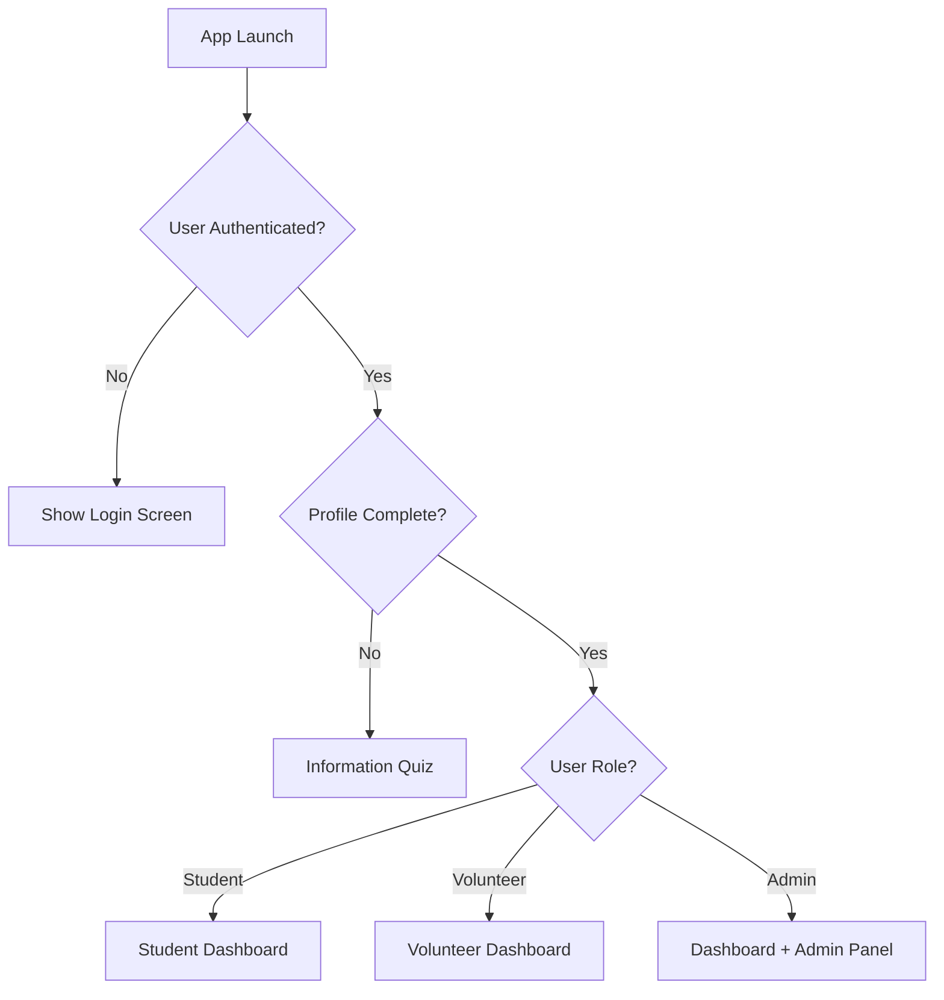

# GrowTogether Mobile App — Functional Specification

> **Purpose:** This document describes the end-to-end user flows, roles, data model, and core features for the GrowTogether mobile app. It serves as a comprehensive guide for design, implementation, and QA teams.
## Tech Stack
Frontend: React Native with TypeScript, Expo, and Expo Router
Backend/Database: Supabase
UI Framework: React Native Paper
AI Processing: DeepSeek

## 📋 Table of Contents

- [Overview](#overview)
- [User Roles & States](#user-roles--states)
- [Authentication & Onboarding](#authentication--onboarding)
- [Navigation Structure](#navigation-structure)
- [Student Experience](#student-experience)
- [Volunteer Experience](#volunteer-experience)
- [Admin Experience](#admin-experience)
- [Settings & Profile Management](#settings--profile-management)
- [Matching Logic](#matching-logic)
- [Chat System](#chat-system)
- [Data Models](#data-models)
- [Database Schema](#database-schema)
- [App Folder Structure](#app-folder-structure)
- [Permissions Matrix](#permissions-matrix)
- [UI Screens & Components](#ui-screens--components)
- [Business Rules & Edge Cases](#business-rules--edge-cases)
- [Technical Requirements](#technical-requirements)
- [Copy & Messaging](#copy--messaging)
- [Acceptance Criteria](#acceptance-criteria)

---

## Overview

GrowTogether is a mobile tutoring platform that connects students with volunteer tutors within their school district. The app facilitates peer-to-peer academic support through a secure, admin-moderated environment.

**Key Features:**
- Student-volunteer matching based on subject, grade level, and availability
- Real-time messaging system
- Admin oversight and role management
- Profile management and onboarding

---

## User Roles & States

### 🎯 Primary Roles

| Role | Description | Promotion Path |
|------|-------------|----------------|
| **Student** | Default role for all new users | Can be promoted to Volunteer by Admin |
| **Volunteer** | Students promoted by admins to provide tutoring | Promoted from Student role |
| **Administrator** | Email-whitelisted accounts with elevated privileges | Determined by email allowlist |

### 🔄 User States

Every account exists in one of two states:
- `student` - Seeking academic help
- `volunteer` - Providing tutoring services

> **Note:** Admins retain their user state (student or volunteer) while gaining additional administrative capabilities.

---

## Authentication & Onboarding

### 🚀 App Launch Flow



### 🔐 Login Process

**Method:** Google OAuth Sign-In

**Flow:**
1. User taps Google Sign-In button
2. OAuth flow completes
3. System creates or retrieves user profile
4. Determines role (student/volunteer) from server
5. Checks admin status via email allowlist
6. Routes to appropriate dashboard

### 📝 Information Quiz

**Trigger:** First-time users or incomplete profiles

**Required Fields:**

| Field | Type | Options |
|-------|------|---------|
| First Name | Text Input | - |
| Last Name | Text Input | - |
| Current Grade | Dropdown | 1-12 |
| Age | Dropdown | Integer range (TBD) |
| School | Dropdown | [See School List](#school-list) |
| Subject Preference | Dropdown | [See Subject List](#subject-list) |
| Availability | Multi-select | Mon-Sun |

#### School List
- Francis A. Desmares School
- Hunterdon County Polytech School
- Reading-Fleming Intermediate School
- Robert Hunter School
- JP Case Middle School
- Barley Sheaf School
- Three Bridges School
- Woodfern Elementary School
- High Bridge Elementary School
- Union Township Elementary School
- Clinton Public School
- Round Valley School
- Lebanon Borough School
- Patrick McGaheran School
- Franklin Township School
- Whitehouse School
- Readington Middle School
- Holland Brook School
- The Midland School
- Stony Brook Elementary School
- North Hunterdon High School
- South Hunterdon Regional High School
- Hunterdon Central Regional High School

#### Subject List
- Math
- English/Language Arts
- Science
- History/Social Studies
- General Homework Help

**Actions:**
- Navigation: Back/Next buttons or single-page form
- Submit → Profile creation → Route to Student Dashboard

---

## Navigation Structure

### 🧭 Main Navigation Pattern

| Navigation | Method | Destination |
|------------|--------|-------------|
| **Center Tab** | Default | Dashboard |
| **Left Swipe** | Gesture | "Become a Volunteer" info page |
| **Right Swipe** | Gesture | Chats list |
| **Settings** | Gear icon (top-right) | Settings/Profile |
| **Admin Panel** | Tab/Nav (admins only) | Admin dashboard |

> **Global Feature:** Sign Out option available in Settings across all views.

---

## Student Experience

### 📱 Student Dashboard

#### Header Layout
```
[First Name]           [⚙️]
[Grade Level]
```

#### Main Content
**"Potential Volunteers" List**

**Filtering Criteria:**
- ✅ Schedule overlap with student availability
- ✅ Subject match (student need ↔ volunteer expertise)
- ✅ Grade compatibility (student grade within volunteer's comfort range)

**Volunteer Card Components:**
- Volunteer name (first name/initial)
- Subjects tutored
- Grade range served
- School (optional)
- Overlapping available days
- "Start Chat" button

#### Interactions
- **Tap volunteer card** → Opens/creates 1:1 chat
- **Swipe left** → "Become a Volunteer" page
- **Swipe right** → Chats list

### 💬 Student Chat Experience

**Chat List Features:**
- Inbox-style layout
- Real-time/near-real-time messaging
- Message thread preview
- Timestamp display

**Chat Thread Features:**
- Message bubbles
- "Close Chat" button with confirmation
- Real-time message delivery

**Close Chat Flow:**
```
[Close Chat] → Confirmation Dialog → Archive for both users
Admin retains access to archived chats
```

---

## Volunteer Experience

### 🎓 Volunteer Promotion Flow

1. Admin promotes student to volunteer
2. Next app session: Prompt to complete volunteer profile
3. Blocking banner until profile completion

### 📋 Additional Volunteer Profile

**Required Fields:**
- **Grade Levels Comfortable Tutoring**
  - Multi-select or range (e.g., 1-5, 6-8, 9-12)
  - Explicit grade selection (1-12)
- **Subjects to Tutor**
  - Multi-select from standard subject list
  - Same options as student subject preferences

**Validation Rules:**
- ✅ At least one subject selected
- ✅ At least one grade level selected
- ❌ Incomplete profile = not discoverable by students

### 📱 Volunteer Dashboard

#### Header
```
[First Name] [Volunteer]     [⚙️]
```

#### Content
- **Info Message:** "Students select you; you cannot initiate chats."
- **Active Chats:** Quick access list (if any exist)
- **Discovery Status:** "Discoverable" indicator (only if profile complete)

### 💬 Volunteer Chat Experience

**Features:**
- Inbox of student-initiated chats
- Message thread interface
- "Complete Chat" action

**Complete Chat Flow:**
```
[Complete Chat] → Confirmation → Remove for both users → Archive
Toast: "You will be notified about volunteer hours awards."
```

---

## Admin Experience

### 🛡️ Admin Access Model

**Principle:** Admins retain their user role (student/volunteer) while gaining administrative capabilities.

**Access Method:** Email allowlist verification

### 🎛️ Admin Panel

#### 1. Role Management
**Features:**
- Email address input field
- **Actions:**
  - Promote to Volunteer
  - Demote to Student
- Success/failure notifications
- Server-side action logging

#### 2. Chat Oversight
**Search & Browse:**
- **Filters:**
  - Status: active, student-closed, volunteer-completed
  - Participant email/name
  - Date range
- **Views:**
  - Read-only full chat history
  - Active and archived conversations

**Admin Messaging:**
- Create new 1:1 admin-to-user chats
- Send messages to existing threads
- Notify volunteers about hours/awards
- Optional subject/title for new threads

#### 3. User Directory
**Features:**
- User list with key information:
  - Role (student/volunteer)
  - Profile completion status
  - Last active timestamp
- Profile viewing (read-only or admin-editable)
- User search functionality

---

## Settings & Profile Management

### ⚙️ Settings Screen (All Users)

**Editable Profile Fields:**
- Personal information (name, age, grade)
- School selection
- Subject preferences
- Availability schedule
- **Volunteers only:** Grade levels, tutoring subjects

**UI Requirements:**
- Explicit "Save" button (disabled until changes made)
- "Log Out" button
- Validation indicators for incomplete fields

**Volunteer-Specific:**
- Profile completion blocker for discoverability
- Clear indication of required vs. optional fields

---

## Matching Logic

### 🎯 Volunteer Discovery Algorithm

A volunteer `V` appears on student `S` dashboard if **ALL** conditions are met:

#### Matching Criteria
```javascript
// Pseudo-code for matching logic
function isVolunteerMatch(student, volunteer) {
  // 1. Availability overlap
  const hasScheduleOverlap = student.availability.some(day => 
    volunteer.availability.includes(day)
  );
  
  // 2. Subject compatibility
  const hasSubjectMatch = 
    volunteer.subjectsToTutor.includes(student.subjectPreference) ||
    student.subjectPreference === "General Homework Help";
  
  // 3. Grade level compatibility
  const isGradeMatch = volunteer.gradeLevelsComfortable.includes(student.currentGrade);
  
  // 4. Profile completeness
  const isProfileComplete = volunteer.isComplete && volunteer.isActive;
  
  return hasScheduleOverlap && hasSubjectMatch && isGradeMatch && isProfileComplete;
}
```

#### Sorting Priority
1. **Primary:** Number of overlapping available days (descending)
2. **Secondary:** Exact subject match > general help
3. **Tertiary:** Most recent activity

#### Privacy Rules
- ❌ Volunteers cannot browse or search for students
- ✅ Students see limited volunteer info (name/initial, subjects, grade range, availability)
- ❌ Email addresses hidden from students

---

## Chat System

### 💬 Chat States & Lifecycle

#### State Machine
```
active → student_closed → archived
active → volunteer_completed → archived
```

#### State Definitions
| State | Description | Visibility |
|-------|-------------|------------|
| `active` | Ongoing conversation | Both participants |
| `student_closed` | Student ended chat | Admin only |
| `volunteer_completed` | Volunteer marked complete | Admin only |
| `archived` | Final state | Admin only |

#### Behavior Rules
- **Student closes:** Chat disappears from both inboxes, admin retains access
- **Volunteer completes:** Chat disappears from both inboxes, admin retains access
- **Admin access:** Always available regardless of state
- **Notifications:** Push notifications for new messages and state changes

---

## Data Models

### 👤 User Model
```typescript
interface User {
  userId: string;
  email: string;
  firstName: string;
  lastName: string;
  role: "student" | "volunteer";
  isAdmin: boolean;
  age: number;
  currentGrade: number; // 1-12
  school: SchoolEnum;
  studentSubjectPreference: SubjectEnum;
  availability: {
    mon: boolean;
    tue: boolean;
    wed: boolean;
    thu: boolean;
    fri: boolean;
    sat: boolean;
    sun: boolean;
  };
  volunteerProfile?: {
    subjectsToTutor: SubjectEnum[];
    gradeLevelsComfortable: number[]; // 1-12
    isComplete: boolean;
  };
  createdAt: Date;
  updatedAt: Date;
  lastActiveAt: Date;
}
```

### 💬 Chat Model
```typescript
interface Chat {
  chatId: string;
  participants: string[]; // [studentUserId, volunteerUserId] or [adminUserId, targetUserId]
  createdBy: string; // userId
  status: "active" | "student_closed" | "volunteer_completed" | "archived";
  messages: Message[];
  closedBy?: string; // userId
  closedAt?: Date;
  completedAt?: Date;
}

interface Message {
  messageId: string;
  senderId: string;
  text: string;
  createdAt: Date;
}
```

### 📊 Admin Action Log
```typescript
interface AdminActionLog {
  actionId: string;
  adminUserId: string;
  actionType: "PROMOTE" | "DEMOTE" | "ADMIN_MESSAGE";
  targetUserEmail?: string;
  targetUserId?: string;
  metadata: Record<string, any>;
  createdAt: Date;
}
```

---

## Database Schema

### 🗄️ Supabase Database Design

#### Core Tables

##### `users` Table
```sql
CREATE TABLE users (
  id UUID PRIMARY KEY DEFAULT gen_random_uuid(),
  email TEXT UNIQUE NOT NULL,
  first_name TEXT NOT NULL,
  last_name TEXT NOT NULL,
  role TEXT NOT NULL CHECK (role IN ('student', 'volunteer')),
  is_admin BOOLEAN DEFAULT FALSE,
  age INTEGER CHECK (age >= 5 AND age <= 25),
  current_grade INTEGER CHECK (current_grade >= 1 AND current_grade <= 12),
  school TEXT NOT NULL,
  student_subject_preference TEXT NOT NULL,
  
  -- Availability as JSONB for flexible querying
  availability JSONB NOT NULL DEFAULT '{}',
  
  -- Profile completion tracking
  profile_completed_at TIMESTAMPTZ,
  volunteer_profile_completed_at TIMESTAMPTZ,
  
  -- Audit fields
  created_at TIMESTAMPTZ DEFAULT NOW(),
  updated_at TIMESTAMPTZ DEFAULT NOW(),
  last_active_at TIMESTAMPTZ DEFAULT NOW(),
  
  -- Soft delete
  deleted_at TIMESTAMPTZ
);

-- Indexes for performance
CREATE INDEX idx_users_role ON users(role);
CREATE INDEX idx_users_school ON users(school);
CREATE INDEX idx_users_is_admin ON users(is_admin);
CREATE INDEX idx_users_email ON users(email);
CREATE INDEX idx_users_last_active ON users(last_active_at);
```

##### `volunteer_profiles` Table
```sql
CREATE TABLE volunteer_profiles (
  id UUID PRIMARY KEY DEFAULT gen_random_uuid(),
  user_id UUID NOT NULL REFERENCES users(id) ON DELETE CASCADE,
  
  -- Tutoring preferences
  subjects_to_tutor JSONB NOT NULL DEFAULT '[]',
  grade_levels_comfortable JSONB NOT NULL DEFAULT '[]',
  
  -- Status tracking
  is_complete BOOLEAN DEFAULT FALSE,
  is_discoverable BOOLEAN DEFAULT FALSE,
  
  -- Audit fields
  created_at TIMESTAMPTZ DEFAULT NOW(),
  updated_at TIMESTAMPTZ DEFAULT NOW(),
  
  UNIQUE(user_id)
);

-- Indexes
CREATE INDEX idx_volunteer_profiles_user_id ON volunteer_profiles(user_id);
CREATE INDEX idx_volunteer_profiles_discoverable ON volunteer_profiles(is_discoverable);
```

##### `chats` Table
```sql
CREATE TABLE chats (
  id UUID PRIMARY KEY DEFAULT gen_random_uuid(),
  
  -- Participants (always 2 users)
  student_user_id UUID NOT NULL REFERENCES users(id),
  volunteer_user_id UUID NOT NULL REFERENCES users(id),
  created_by UUID NOT NULL REFERENCES users(id),
  
  -- Chat lifecycle
  status TEXT NOT NULL DEFAULT 'active' 
    CHECK (status IN ('active', 'student_closed', 'volunteer_completed', 'archived')),
  
  -- Closure tracking
  closed_by UUID REFERENCES users(id),
  closed_at TIMESTAMPTZ,
  completed_at TIMESTAMPTZ,
  
  -- Audit fields
  created_at TIMESTAMPTZ DEFAULT NOW(),
  updated_at TIMESTAMPTZ DEFAULT NOW(),
  
  -- Ensure unique active chats between same participants
  UNIQUE(student_user_id, volunteer_user_id, status) 
    DEFERRABLE INITIALLY DEFERRED
);

-- Indexes
CREATE INDEX idx_chats_student_user_id ON chats(student_user_id);
CREATE INDEX idx_chats_volunteer_user_id ON chats(volunteer_user_id);
CREATE INDEX idx_chats_status ON chats(status);
CREATE INDEX idx_chats_created_at ON chats(created_at);
```

##### `messages` Table
```sql
CREATE TABLE messages (
  id UUID PRIMARY KEY DEFAULT gen_random_uuid(),
  chat_id UUID NOT NULL REFERENCES chats(id) ON DELETE CASCADE,
  sender_id UUID NOT NULL REFERENCES users(id),
  
  -- Message content
  content TEXT NOT NULL,
  message_type TEXT DEFAULT 'text' CHECK (message_type IN ('text', 'system', 'admin')),
  
  -- Read status
  read_at TIMESTAMPTZ,
  
  -- Audit fields
  created_at TIMESTAMPTZ DEFAULT NOW(),
  updated_at TIMESTAMPTZ DEFAULT NOW(),
  
  -- Soft delete for message history
  deleted_at TIMESTAMPTZ
);

-- Indexes for performance
CREATE INDEX idx_messages_chat_id ON messages(chat_id);
CREATE INDEX idx_messages_sender_id ON messages(sender_id);
CREATE INDEX idx_messages_created_at ON messages(created_at);
CREATE INDEX idx_messages_read_status ON messages(read_at);
```

##### `admin_action_logs` Table
```sql
CREATE TABLE admin_action_logs (
  id UUID PRIMARY KEY DEFAULT gen_random_uuid(),
  admin_user_id UUID NOT NULL REFERENCES users(id),
  
  -- Action details
  action_type TEXT NOT NULL 
    CHECK (action_type IN ('PROMOTE', 'DEMOTE', 'ADMIN_MESSAGE', 'CHAT_ARCHIVE')),
  target_user_id UUID REFERENCES users(id),
  target_email TEXT,
  
  -- Action context
  metadata JSONB DEFAULT '{}',
  description TEXT,
  
  -- Audit
  created_at TIMESTAMPTZ DEFAULT NOW()
);

-- Indexes
CREATE INDEX idx_admin_logs_admin_user_id ON admin_action_logs(admin_user_id);
CREATE INDEX idx_admin_logs_action_type ON admin_action_logs(action_type);
CREATE INDEX idx_admin_logs_target_user_id ON admin_action_logs(target_user_id);
CREATE INDEX idx_admin_logs_created_at ON admin_action_logs(created_at);
```

#### Lookup Tables

##### `schools` Table
```sql
CREATE TABLE schools (
  id UUID PRIMARY KEY DEFAULT gen_random_uuid(),
  name TEXT UNIQUE NOT NULL,
  district TEXT,
  type TEXT CHECK (type IN ('elementary', 'middle', 'high', 'k12')),
  is_active BOOLEAN DEFAULT TRUE,
  created_at TIMESTAMPTZ DEFAULT NOW()
);

-- Insert predefined schools
INSERT INTO schools (name, type) VALUES
  ('Francis A. Desmares School', 'elementary'),
  ('Hunterdon County Polytech School', 'high'),
  ('Reading-Fleming Intermediate School', 'middle'),
  ('Robert Hunter School', 'elementary'),
  ('JP Case Middle School', 'middle'),
  ('Barley Sheaf School', 'elementary'),
  ('Three Bridges School', 'elementary'),
  ('Woodfern Elementary School', 'elementary'),
  ('High Bridge Elementary School', 'elementary'),
  ('Union Township Elementary School', 'elementary'),
  ('Clinton Public School', 'k12'),
  ('Round Valley School', 'elementary'),
  ('Lebanon Borough School', 'elementary'),
  ('Patrick McGaheran School', 'elementary'),
  ('Franklin Township School', 'elementary'),
  ('Whitehouse School', 'elementary'),
  ('Readington Middle School', 'middle'),
  ('Holland Brook School', 'elementary'),
  ('The Midland School', 'elementary'),
  ('Stony Brook Elementary School', 'elementary'),
  ('North Hunterdon High School', 'high'),
  ('South Hunterdon Regional High School', 'high'),
  ('Hunterdon Central Regional High School', 'high');
```

##### `subjects` Table
```sql
CREATE TABLE subjects (
  id UUID PRIMARY KEY DEFAULT gen_random_uuid(),
  name TEXT UNIQUE NOT NULL,
  category TEXT,
  is_active BOOLEAN DEFAULT TRUE,
  created_at TIMESTAMPTZ DEFAULT NOW()
);

-- Insert predefined subjects
INSERT INTO subjects (name, category) VALUES
  ('Math', 'core'),
  ('English/Language Arts', 'core'),
  ('Science', 'core'),
  ('History/Social Studies', 'core'),
  ('General Homework Help', 'support');
```

#### Views for Complex Queries

##### `volunteer_matches` View
```sql
CREATE VIEW volunteer_matches AS
SELECT 
  s.id as student_id,
  v.id as volunteer_id,
  s.first_name as student_name,
  v.first_name as volunteer_name,
  s.current_grade,
  s.school,
  s.student_subject_preference,
  vp.subjects_to_tutor,
  vp.grade_levels_comfortable,
  
  -- Calculate availability overlap
  (
    SELECT COUNT(*)
    FROM jsonb_object_keys(s.availability) sk
    JOIN jsonb_object_keys(v.availability) vk ON sk = vk
    WHERE (s.availability->sk)::boolean = true 
    AND (v.availability->vk)::boolean = true
  ) as overlapping_days,
  
  -- Subject match priority
  CASE 
    WHEN vp.subjects_to_tutor ? s.student_subject_preference THEN 2
    WHEN s.student_subject_preference = 'General Homework Help' THEN 1
    ELSE 0
  END as subject_match_score

FROM users s
JOIN users v ON v.role = 'volunteer' AND v.deleted_at IS NULL
JOIN volunteer_profiles vp ON vp.user_id = v.id AND vp.is_discoverable = true
WHERE s.role = 'student' 
  AND s.deleted_at IS NULL
  AND s.profile_completed_at IS NOT NULL
  AND vp.grade_levels_comfortable ? s.current_grade::text
  AND EXISTS (
    SELECT 1
    FROM jsonb_object_keys(s.availability) sk
    JOIN jsonb_object_keys(v.availability) vk ON sk = vk
    WHERE (s.availability->sk)::boolean = true 
    AND (v.availability->vk)::boolean = true
  );
```

#### Row Level Security (RLS) Policies

```sql
-- Enable RLS on all tables
ALTER TABLE users ENABLE ROW LEVEL SECURITY;
ALTER TABLE volunteer_profiles ENABLE ROW LEVEL SECURITY;
ALTER TABLE chats ENABLE ROW LEVEL SECURITY;
ALTER TABLE messages ENABLE ROW LEVEL SECURITY;
ALTER TABLE admin_action_logs ENABLE ROW LEVEL SECURITY;

-- Users can read their own data
CREATE POLICY "Users can view own profile" ON users
  FOR SELECT USING (auth.uid() = id);

-- Users can update their own data
CREATE POLICY "Users can update own profile" ON users
  FOR UPDATE USING (auth.uid() = id);

-- Students can view discoverable volunteers
CREATE POLICY "Students can view volunteers" ON users
  FOR SELECT USING (
    role = 'volunteer' 
    AND EXISTS (
      SELECT 1 FROM volunteer_profiles 
      WHERE user_id = users.id AND is_discoverable = true
    )
  );

-- Chat access policies
CREATE POLICY "Users can view own chats" ON chats
  FOR SELECT USING (
    auth.uid() = student_user_id 
    OR auth.uid() = volunteer_user_id
    OR EXISTS (SELECT 1 FROM users WHERE id = auth.uid() AND is_admin = true)
  );

-- Message access policies
CREATE POLICY "Users can view chat messages" ON messages
  FOR SELECT USING (
    EXISTS (
      SELECT 1 FROM chats 
      WHERE chats.id = messages.chat_id 
      AND (
        auth.uid() = student_user_id 
        OR auth.uid() = volunteer_user_id
        OR EXISTS (SELECT 1 FROM users WHERE id = auth.uid() AND is_admin = true)
      )
    )
  );
```

#### Database Functions

##### Matching Algorithm Function
```sql
CREATE OR REPLACE FUNCTION get_volunteer_matches(student_id UUID)
RETURNS TABLE (
  volunteer_id UUID,
  volunteer_name TEXT,
  subjects JSONB,
  grade_levels JSONB,
  school TEXT,
  overlapping_days INTEGER,
  subject_match_score INTEGER
) AS $$
BEGIN
  RETURN QUERY
  SELECT 
    vm.volunteer_id,
    vm.volunteer_name,
    vm.subjects_to_tutor,
    vm.grade_levels_comfortable,
    vm.school,
    vm.overlapping_days,
    vm.subject_match_score
  FROM volunteer_matches vm
  WHERE vm.student_id = get_volunteer_matches.student_id
    AND vm.overlapping_days > 0
    AND vm.subject_match_score > 0
  ORDER BY 
    vm.subject_match_score DESC,
    vm.overlapping_days DESC,
    vm.volunteer_name ASC;
END;
$$ LANGUAGE plpgsql SECURITY DEFINER;
```

---

## App Folder Structure

### 📁 React Native + Expo Router Structure

```
GrowTogether/
├── 📱 App Configuration
│   ├── app.json                 # Expo configuration
│   ├── eas.json                 # EAS Build configuration
│   ├── expo-env.d.ts           # Expo TypeScript definitions
│   ├── package.json            # Dependencies and scripts
│   ├── tsconfig.json           # TypeScript configuration
│   └── babel.config.js         # Babel configuration
│
├── 📂 src/
│   ├── 📂 app/                 # Expo Router app directory
│   │   ├── (auth)/             # Auth group routes
│   │   │   ├── login.tsx       # Login screen
│   │   │   └── onboarding/     # Onboarding flow
│   │   │       ├── quiz.tsx    # Information quiz
│   │   │       └── volunteer-setup.tsx
│   │   │
│   │   ├── (tabs)/             # Main app tabs
│   │   │   ├── _layout.tsx     # Tab layout
│   │   │   ├── dashboard.tsx   # Student/Volunteer dashboard
│   │   │   ├── chats/          # Chat screens
│   │   │   │   ├── index.tsx   # Chats list
│   │   │   │   └── [id].tsx    # Chat thread
│   │   │   ├── volunteer-info.tsx  # Become a volunteer page
│   │   │   └── settings.tsx    # Settings screen
│   │   │
│   │   ├── (admin)/            # Admin-only routes
│   │   │   ├── _layout.tsx     # Admin layout
│   │   │   ├── panel.tsx       # Admin dashboard
│   │   │   ├── users.tsx       # User management
│   │   │   └── chats.tsx       # Chat oversight
│   │   │
│   │   ├── _layout.tsx         # Root layout
│   │   └── +not-found.tsx      # 404 screen
│   │
│   ├── 📂 components/          # Reusable UI components
│   │   ├── 📂 ui/              # Base UI components
│   │   │   ├── Button.tsx
│   │   │   ├── Card.tsx
│   │   │   ├── Input.tsx
│   │   │   ├── Modal.tsx
│   │   │   ├── Loading.tsx
│   │   │   └── index.ts        # Export barrel
│   │   │
│   │   ├── 📂 forms/           # Form components
│   │   │   ├── ProfileForm.tsx
│   │   │   ├── VolunteerForm.tsx
│   │   │   ├── QuizForm.tsx
│   │   │   └── index.ts
│   │   │
│   │   ├── 📂 chat/            # Chat-specific components
│   │   │   ├── ChatList.tsx
│   │   │   ├── ChatThread.tsx
│   │   │   ├── MessageBubble.tsx
│   │   │   ├── MessageInput.tsx
│   │   │   └── index.ts
│   │   │
│   │   ├── 📂 dashboard/       # Dashboard components
│   │   │   ├── VolunteerCard.tsx
│   │   │   ├── StudentDashboard.tsx
│   │   │   ├── VolunteerDashboard.tsx
│   │   │   └── index.ts
│   │   │
│   │   └── 📂 admin/           # Admin components
│   │       ├── UserList.tsx
│   │       ├── ChatOversight.tsx
│   │       ├── RoleManager.tsx
│   │       └── index.ts
│   │
│   ├── 📂 hooks/               # Custom React hooks
│   │   ├── useAuth.ts          # Authentication hook
│   │   ├── useProfile.ts       # Profile management
│   │   ├── useChats.ts         # Chat functionality
│   │   ├── useMatching.ts      # Volunteer matching
│   │   ├── useRealtime.ts      # Real-time subscriptions
│   │   ├── useAdmin.ts         # Admin functionality
│   │   └── index.ts
│   │
│   ├── 📂 services/            # API and external services
│   │   ├── 📂 api/             # API layer
│   │   │   ├── auth.ts         # Authentication API
│   │   │   ├── users.ts        # User management API
│   │   │   ├── chats.ts        # Chat API
│   │   │   ├── matching.ts     # Matching algorithm API
│   │   │   ├── admin.ts        # Admin API
│   │   │   └── index.ts
│   │   │
│   │   ├── supabase.ts         # Supabase client configuration
│   │   ├── notifications.ts    # Push notifications
│   │   ├── storage.ts          # Local storage utilities
│   │   └── deepseek.ts         # AI processing service
│   │
│   ├── 📂 store/               # State management (Zustand)
│   │   ├── authStore.ts        # Authentication state
│   │   ├── profileStore.ts     # User profile state
│   │   ├── chatStore.ts        # Chat state
│   │   ├── adminStore.ts       # Admin state
│   │   └── index.ts
│   │
│   ├── 📂 types/               # TypeScript type definitions
│   │   ├── auth.ts             # Auth types
│   │   ├── user.ts             # User types
│   │   ├── chat.ts             # Chat types
│   │   ├── database.ts         # Database types
│   │   ├── api.ts              # API response types
│   │   └── index.ts
│   │
│   ├── 📂 utils/               # Utility functions
│   │   ├── validation.ts       # Form validation
│   │   ├── formatting.ts       # Data formatting
│   │   ├── constants.ts        # App constants
│   │   ├── permissions.ts      # Permission utilities
│   │   ├── matching.ts         # Matching algorithm helpers
│   │   └── index.ts
│   │
│   ├── 📂 styles/              # Styling and themes
│   │   ├── theme.ts            # React Native Paper theme
│   │   ├── colors.ts           # Color palette
│   │   ├── typography.ts       # Text styles
│   │   ├── spacing.ts          # Spacing system
│   │   └── index.ts
│   │
│   └── 📂 assets/              # Static assets
│       ├── 📂 images/          # Images and icons
│       ├── 📂 fonts/           # Custom fonts
│       └── 📂 sounds/          # Sound files
│
├── 📂 docs/                    # Documentation
│   ├── CONTEXT.md              # This specification
│   ├── API.md                  # API documentation
│   ├── DEPLOYMENT.md           # Deployment guide
│   └── TESTING.md              # Testing guide
│
├── 📂 scripts/                 # Build and deployment scripts
│   ├── setup.sh               # Development setup
│   ├── build.sh               # Build script
│   └── deploy.sh              # Deployment script
│
├── 📂 __tests__/              # Test files
│   ├── 📂 components/         # Component tests
│   ├── 📂 hooks/              # Hook tests
│   ├── 📂 services/           # Service tests
│   ├── 📂 utils/              # Utility tests
│   └── setup.ts               # Test setup
│
├── .env.local                 # Local environment variables
├── .env.example               # Environment variables template
├── .gitignore                 # Git ignore rules
├── README.md                  # Project documentation
└── yarn.lock                  # Dependency lock file
```

### 📋 Key Architectural Decisions

#### 1. **Expo Router File-Based Routing**
- **Groups**: `(auth)`, `(tabs)`, `(admin)` for logical organization
- **Dynamic Routes**: `[id].tsx` for chat threads
- **Layouts**: Nested layouts for different app sections

#### 2. **Component Organization**
- **Feature-based**: Components grouped by functionality
- **Barrel Exports**: `index.ts` files for clean imports
- **Separation of Concerns**: UI, forms, and feature components separated

#### 3. **State Management Strategy**
- **Zustand**: Lightweight state management
- **Store Separation**: Dedicated stores for different domains
- **React Query**: Server state management and caching

#### 4. **Service Layer Architecture**
- **API Abstraction**: Clean separation between UI and data layer
- **Supabase Integration**: Centralized database client
- **Real-time Subscriptions**: WebSocket connections for chat

#### 5. **Type Safety**
- **Generated Types**: Database types from Supabase
- **Strict TypeScript**: Full type coverage
- **API Types**: Request/response type definitions

#### 6. **Testing Structure**
- **Co-located Tests**: Tests mirror src structure
- **Component Testing**: React Native Testing Library
- **Integration Tests**: End-to-end user flows

### 🛠️ Development Workflow

#### **Environment Setup**
```bash
# Install dependencies
yarn install

# Set up environment variables
cp .env.example .env.local

# Start development server
yarn start

# Run on specific platform
yarn ios
yarn android
```

#### **Code Generation**
```bash
# Generate Supabase types
yarn supabase gen types typescript --project-id <project-id> > src/types/database.ts

# Generate API client
yarn generate-api
```

#### **Build Process**
```bash
# Development build
yarn build:dev

# Production build
yarn build:prod

# EAS Build
eas build --platform all
```

This folder structure provides:
- **Scalability**: Easy to add new features and screens
- **Maintainability**: Clear separation of concerns
- **Type Safety**: Full TypeScript integration
- **Performance**: Optimized imports and lazy loading
- **Testing**: Comprehensive test coverage structure

---

## Permissions Matrix

### 🔐 Role-Based Access Control

| Permission | Student | Volunteer | Admin |
|------------|---------|-----------|-------|
| Edit own profile | ✅ | ✅ | ✅ |
| View matching volunteers | ✅ | ❌ | ✅* |
| Start chat with volunteer | ✅ | ❌ | ✅* |
| Receive student-initiated chats | ❌ | ✅ | ✅* |
| Send/receive messages | ✅ | ✅ | ✅ |
| Close chat | ✅ | ❌ | ✅* |
| Complete chat | ❌ | ✅ | ✅* |
| Edit volunteer profile | ❌ | ✅ | ✅* |
| Access Admin Panel | ❌ | ❌ | ✅ |
| Promote/demote users | ❌ | ❌ | ✅ |
| View all chats | ❌ | ❌ | ✅ |
| Create admin messages | ❌ | ❌ | ✅ |
| Log out | ✅ | ✅ | ✅ |

*\*Admin permissions apply to their own account plus administrative capabilities*

**Security Boundaries:**
- ❌ Admins cannot impersonate users
- ❌ Admins cannot edit user private messages
- ✅ All admin actions logged server-side
- ✅ Server-side authorization required for admin features

---

## UI Screens & Components

### 📱 Screen Inventory

#### 1. Login Screen
**Components:**
- Google Sign-In button (primary CTA)
- Terms/Privacy links
- App branding/logo

#### 2. Information Quiz
**Layout Options:**
- Multi-step wizard with progress indicator
- Single-page form with grouped sections

**Components:**
- Form fields per [quiz requirements](#information-quiz)
- "Save & Continue" button
- Validation messaging

#### 3. Student Dashboard
**Layout:**
```
Header: [Name + Grade] [Settings Icon]
Body: Potential Volunteers List
Footer: Swipe indicators
```

**Components:**
- Volunteer cards with "Start Chat" buttons
- Empty state for no matches
- Pull-to-refresh functionality

#### 4. Become a Volunteer Page
**Content:**
- Informational text about volunteering
- "GrowTogether Website" link button
- External browser navigation

#### 5. Chats List
**Components:**
- Chat thread previews
- Last message timestamps
- Unread message badges
- Empty state for no chats

#### 6. Chat Thread
**Components:**
- Message bubbles (sent/received styling)
- Message input field
- Send button
- Action buttons:
  - Students: "Close Chat"
  - Volunteers: "Complete Chat"
- Confirmation dialogs

#### 7. Settings Screen
**Components:**
- Editable profile fields
- "Save" button (state-aware)
- "Log Out" button
- Field validation indicators

#### 8. Admin Panel
**Layout:**
- Tab navigation: Role Management | Chats | Users
- Tab-specific content areas

**Components:**
- **Role Management:** Email input, action buttons
- **Chats:** Search filters, chat list, thread viewer
- **Users:** User directory, profile viewer

---

## Business Rules & Edge Cases

### 📋 Profile Completeness Rules

#### Students
- ✅ Must complete initial quiz to access volunteer matching
- ❌ Incomplete profile blocks volunteer discovery
- 🔄 All fields editable in Settings

#### Volunteers
- ✅ Must complete volunteer-specific fields for discoverability
- ⚠️ Incomplete profile shows blocking banner
- ❌ Not visible to students until profile complete

### 🔄 Role Change Handling

#### Promotion (Student → Volunteer)
1. Admin promotes user via Admin Panel
2. Next app session: User sees completion prompt
3. User completes volunteer profile fields
4. Becomes discoverable to students

#### Demotion (Volunteer → Student)
1. Admin demotes user via Admin Panel
2. Volunteer-specific fields hidden/ignored
3. Removed from student discovery
4. Existing chats remain active until closed/completed

### 💬 Chat Lifecycle Management

#### Student-Initiated Closure
- Chat disappears from both user inboxes
- Admin retains full access to archived chat
- No impact on volunteer hours tracking

#### Volunteer-Initiated Completion
- Chat disappears from both user inboxes
- Admin retains full access to archived chat
- Triggers volunteer hours review process

#### Admin Messaging
- Independent of chat completion status
- Can message users about hours/awards
- Creates separate admin-to-user threads

### 🔔 Notification Requirements

**Trigger Events:**
- New chat initiated
- New message received
- Chat closed by student
- Chat completed by volunteer
- Admin message received
- Role change (promotion/demotion)

**Delivery Method:** Push notifications with in-app badges

### 🔒 Security & Privacy Rules

#### Data Protection
- Email addresses hidden between students/volunteers
- Chat archives accessible only to admins
- All admin actions logged with timestamps

#### Authorization
- Server-side role verification required
- Admin features behind authentication checks
- Session management for security

---

## Technical Requirements

### 🔐 Authentication
- **Method:** Google OAuth 2.0
- **Implementation:** Backend token exchange
- **Session:** Secure token management

### 💬 Real-time Messaging
- **Requirements:** WebSocket or real-time database
- **Features:** Near-real-time message delivery
- **Fallback:** Polling for connection issues

### 🛡️ Security
- **Authorization:** Server-side role/permission checks
- **Data:** Encrypted in transit and at rest
- **Logging:** Comprehensive audit trail for admin actions

### 🔗 External Integration
- **Links:** External URLs open in system browser
- **Deep Linking:** Not required for MVP

### 📱 Platform Support
- **Target:** Mobile-first design
- **Compatibility:** iOS and Android
- **Responsive:** Tablet support recommended

---

## Copy & Messaging

### 📝 Key User Messages

#### Become a Volunteer Page
> "Want to become a volunteer? Visit the GrowTogether Website to apply."
> 
> [Open Link Button]

#### Confirmation Dialogs

**Student Chat Closure:**
> "Close chat? You won't be able to message in this conversation. The administrator will retain a record."

**Volunteer Chat Completion:**
> "Complete chat? This will end the conversation for both you and the student. The administrator will review hours."

#### Success Messages

**Volunteer Hours Notification:**
> "Thanks for helping! Your volunteer hours for this session will be reviewed and you will be notified soon."

#### Error States
- Network connectivity issues
- Profile save failures
- Chat send failures
- Authentication errors

### 🎨 Tone & Voice
- **Friendly:** Encouraging and supportive
- **Clear:** Simple, jargon-free language
- **Respectful:** Professional but approachable
- **Helpful:** Informative without being overwhelming

---

## Acceptance Criteria

### ✅ Core User Flows

#### New User Onboarding
- [ ] User can sign in with Google OAuth
- [ ] New user completes information quiz
- [ ] User lands on appropriate dashboard based on role
- [ ] Profile data persists correctly

#### Student Experience
- [ ] Student sees matching volunteers based on criteria
- [ ] Student can initiate chat with volunteer
- [ ] Student can send/receive messages in real-time
- [ ] Student can close chat with confirmation
- [ ] Closed chats disappear from both user inboxes

#### Volunteer Experience
- [ ] Promoted student receives volunteer setup prompt
- [ ] Volunteer completes additional profile fields
- [ ] Completed volunteer profile enables student discovery
- [ ] Volunteer can complete chats with confirmation
- [ ] Completed chats disappear from both user inboxes

#### Admin Experience
- [ ] Admin can promote students to volunteers
- [ ] Admin can demote volunteers to students
- [ ] Admin can view all chat contents (active/archived)
- [ ] Admin can send messages to users
- [ ] Admin actions are logged server-side

#### Settings & Profile
- [ ] All users can edit profile information
- [ ] Changes require explicit "Save" action to persist
- [ ] All users can log out successfully
- [ ] Profile validation prevents incomplete volunteer profiles

### 🔍 Quality Assurance

#### Performance
- [ ] App launches within 3 seconds
- [ ] Messages send/receive within 2 seconds
- [ ] Profile saves complete within 1 second

#### Reliability
- [ ] Handles network connectivity issues gracefully
- [ ] Preserves user data during app backgrounding
- [ ] Recovers from authentication token expiry

#### Usability
- [ ] Intuitive navigation between screens
- [ ] Clear feedback for all user actions
- [ ] Accessible to users with disabilities
- [ ] Responsive design across device sizes

---

## 🎯 Implementation Guidance

This specification provides developers with comprehensive guidance on:

- **Architecture:** Clear data models and system relationships
- **User Experience:** Detailed flow descriptions and interaction patterns
- **Security:** Permission matrices and authorization requirements
- **Quality:** Acceptance criteria and testing guidelines

The document should be treated as the single source of truth for GrowTogether's functional requirements, enabling efficient and accurate implementation across design, development, and QA teams.